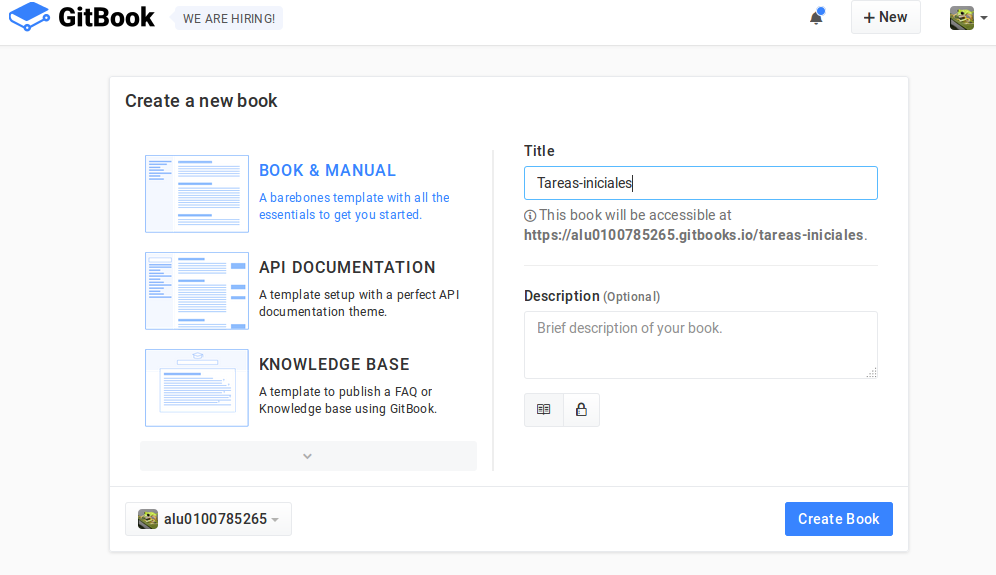
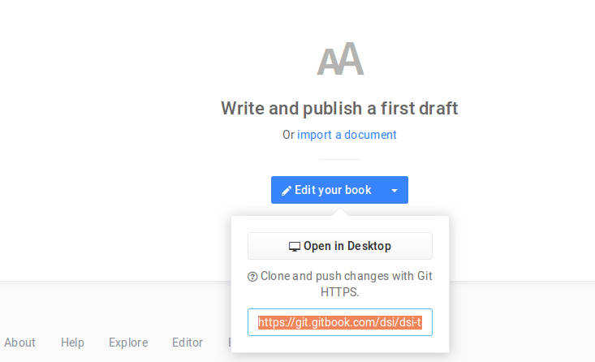

 ## Despliegue en Gitbook 
> ### Pasos para desplegar el libro

>  GitBook está implementando usando node.js, podemos instalarlo usando NPM:

> ```$ npm install gitbook -g```

> Podemos servir un libro directamente desde un repositorio con este comando:

> ```$ gitbook serve ```

> Los documentos se pueden exportar como sitio web independiente incluyendo ejemplos interactivos que pueden ser alojados directamente desde GitHub Pages, 
PDF con la solución de los ejercicios al final del libro, ebook utilizando además un conversor, formato Single Page o JSON 
para extraer metadatos del documento.

> Cuenta con un editor de forma experimental para Windows, Mac y Linux que facilita la escritura en GitBook.
  
> Para sincronizar el libro que se está realizando con Gitbook se utiliza los siguientes comandos:

> * Acceder a gitbook una vez registrados y crear un libro

> *  
>   
 
> * Copiamos la dirección que aparece
> 

> * Después de copiar la dirección nos vamos a la terminal y hacemos lo siguiente para publicar el libro en Gitbook que estamos realizando:

```bash
git remote add gb https://git.gitbook.com/alu0100785265/tarea-inicial.git

```
> y luego el comando 

```bash 
git push --force gb master

```
> Con esto conseguimos que el libro que está en gitbook esté actualizado,,cada vez que introduzcas nueva información al libro tendrás 
que usar los comandos 

```bash 
gitbook build

```

> y el comando siguiente para subir los cambios

```bash 
git push  gb master

```

