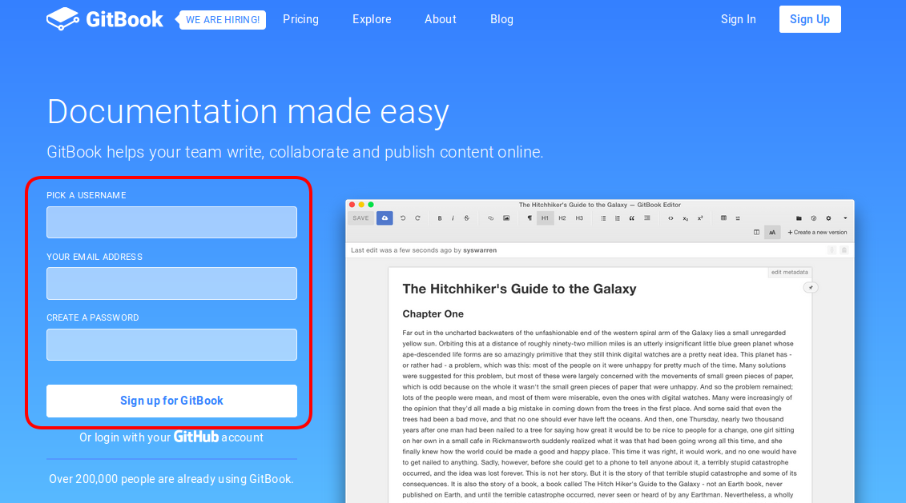

> ### Utilización 
Para comenzar a usar GitBook antes debemos registrarnos en su [página web](www.gitbook.org).
Una vez ahí, rellenamos el formulario de registro que aparecerá en la pantalla de inicio:

Deberás rellenar el formulario con la siguiente información:
* Nombre de usuario
* Correo electrónico
* Contraseña
También te ofrece la opción de registrarte con una cuenta de GitHub si ya dispones de una.
