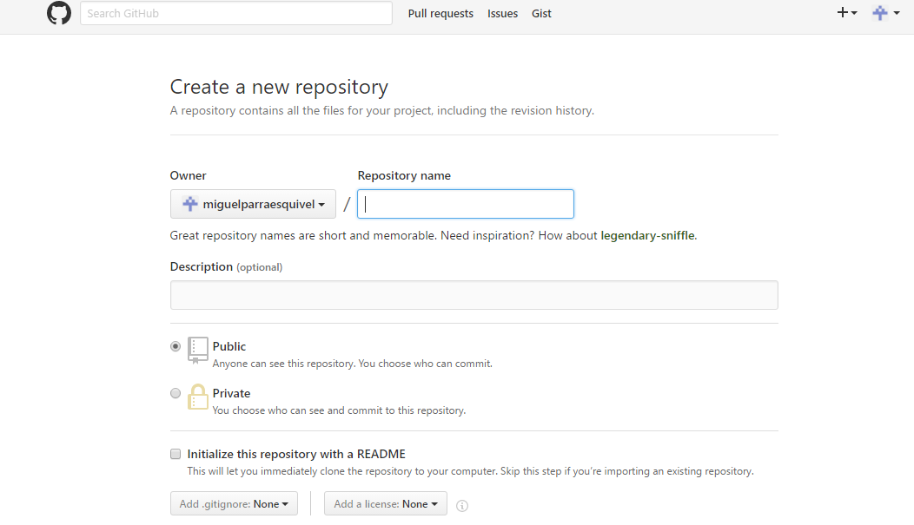

> ### Crear Proyecto

> 1) Arriba a la derecha despues del logueo hay un simbolo mas donde puedes crear un nuevo proyecto. 

> 2) Saldra un formulario donde podremos ponerle un nombre al proyecto.

> 3) Despues podremos elegir si la carpeta es publica o privada.

> 4) Al final hay una tercera zona donde podremos elegir opciones como puede ser el readme el .gitignore y el tipo de licencia del proyecto.

> 
>

