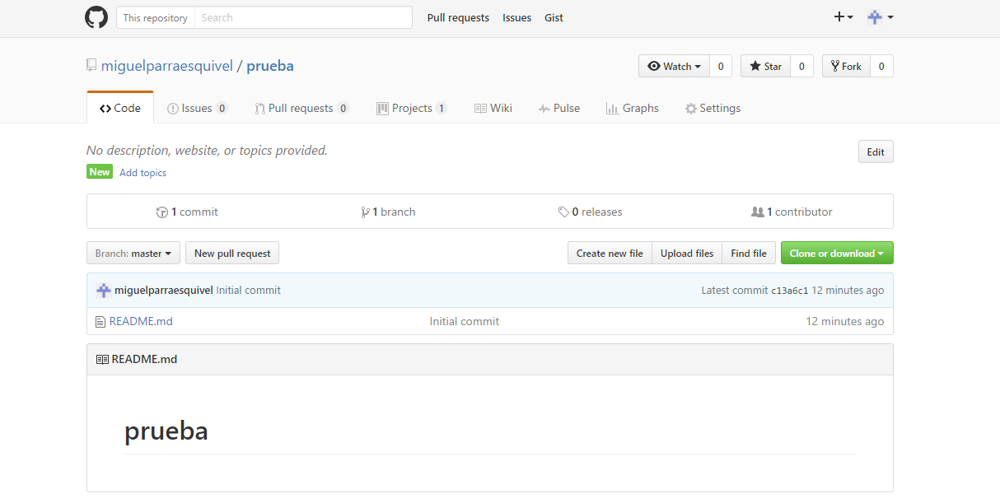

> ### Gestion de un proyecto.
> **Pestaña code :** aqui se puede visualizar el codigo de todos los ficheros.

> **Pestaña issues :** se utiliza para gestionar las incidencias que existen en el proyecto.

> **Pestaña pull request :** En esta pestaña van dejando peticion o propuesta de colaboracion en el proyecto.

> **Pestaña project :** aqui puedes crear un tablero con anotacion para organizar el proyecto por medio de metodologias de desarrollo.

> **Pestaña wiki :** Aqui podras crear una pagina de ayuda para la gestion del proyecto con documentacion ...

> **Pestaña pulse :** Desde aqui se podra gestionar los pull y los issues.

> **Pestaña graphs :** Se podra ver un grafico de las gente que colabora por medio de una escala del 0 al 1.

> **Pestaña setting :** Aqui salen opciones de comunicacion y propiedades del proyecto como pueden ser: option , colaboradores , branches , webhooks , integration and service , deploy key.

> 
