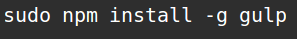
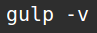
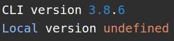

> ## Instalación
Para instalar Gulp el único requisito es tener instalado Nodejs. Si ya disponemos de Nodejs, para el caso de un sistema linux seguiremos los siguientes pasos:

> Comenzaremos ejecutando:

>

> Para comprobar que la instalación se ha realizado de manera correcta ejecutaremos lo siguiente:

>

> Si se ha instalado satisfactoriamente nos aparecerá el siguiente mensaje:

>

> CLI version es la versión de Gulp instalada en nuestro sistema y Local version es la versión de Gulp instalada en nuestro proyecto local, pero como aún no hemos creado ningún proyecto nos saldrá undefined.
