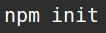
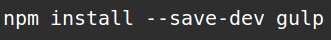
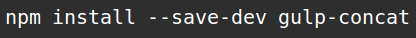
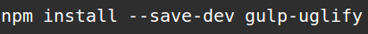

> ## Funcionamiento
Una vez tengamos correctamente Gulp instalado podemos proceder a usarlo en nuestro proyecto. Nos situamos en la carpeta del proyecto seguimos las siguientes instrucciones:

> Primero ejecutamos (se supone que se tiene instalado Nodejs):

> 

> Npm nos solicitará los datos de nuestro proyecto, con dichos datos generará el fichero package.json, que se explica en detalle en otro capítulo.

> ### Instalación de dependencias
> Ahora instalaremos las siguientes dependencias:

>

> Es importante agregar --save-dev, ya que si no lo hacemos entonces Npm no agregará este paquete como una dependencia de desarrollo de nuestro proyecto y mucho menos lo agregará a nuestro archivo package.json.

>

 >[Gulp-concat](https://www.npmjs.com/package/gulp-concat) nos permite concatenar nuestros archivos.

>

>[Gulp-uglify](https://www.npmjs.com/package/gulp-uglify) nos permite minificar nuestros archivos, es decir, que simplifica el formato de nuestro código eliminando peso, con el objetivo de que el navegador lo lea lo más rápido posible.

> Después de haber realizado la instalación de las dependencias, éstas se habrán añadido a nuestro fichero package.json.
