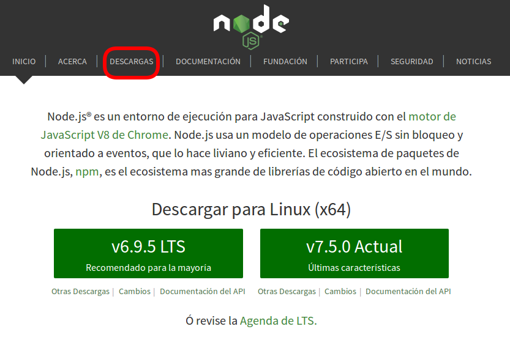
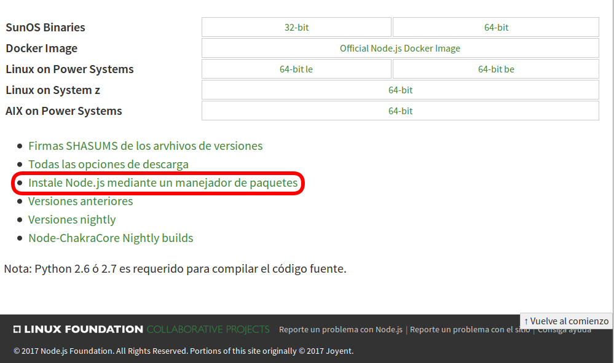

> ## Descarga e instalación

> Para proceder a la descarga de **NodeJS** , hemos de dirigirnos a su [página web](www.nodejs.org).

> Una vez ahí, debemos hacer click en **Descargas** que se encuentra en el menú situado en la parte superior de la página.

> 

> Ahora, en la parte inferior de la página hacemos click sobre **Instale Node.js mediante un manejador de paquetes**.

> 

> En este punto, según el sistema operativo con el que estemos trabajando deberemos dirigirnos al apartado específico para dicho sistema operativo. Para este tutorial usaremos un sistema Linux (Ubuntu), por lo que iremos al apartado "Distribuciones de Linux basadas en Debian y Ubuntu".

> Para proceder a la instalación debemos abrir una terminal y ejecutar los comandos que se nos especifican:

> 

> 
