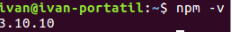

> ## Comprobación del funcionamiento

> Para comprobar que NodeJS se ha instalado correctamente podemos ejecutar lo siguiente en una terminal:

> 

> Esto nos dará la versión de NodeJS que tenemos actualmente instalada en nuestro equipo.

> Para comprobar el correcto funcionamiento podemos ejecutar lo siguiente en una terminal:

> 

> Junto a NodeJS también se instalará el gestor de paquetes para NodeJS denominado **NPM**. Para comprobar que ha sido instalado correctamente ejecutamos lo siguiente en una terminal:

> 

> Ahora, para comprobar el correcto funcionamiento de NPM instalaremos el paquete underscore y posteriormente listaremos los paquetes instalados. Para ello ejecutaremos lo siguiente en una terminal:

> 
