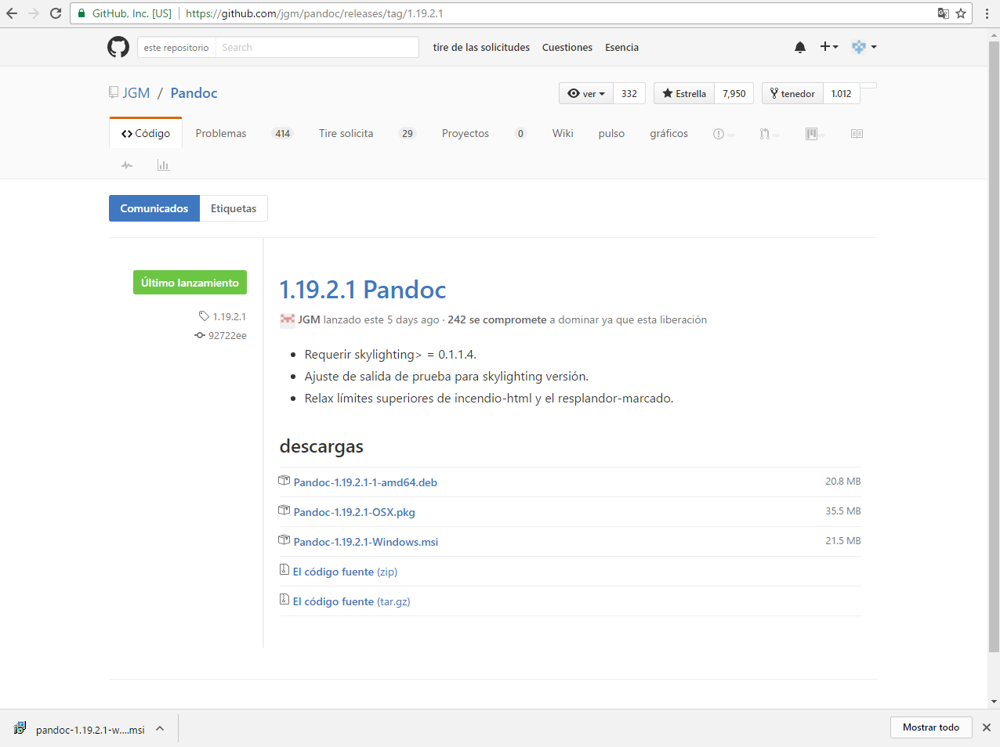
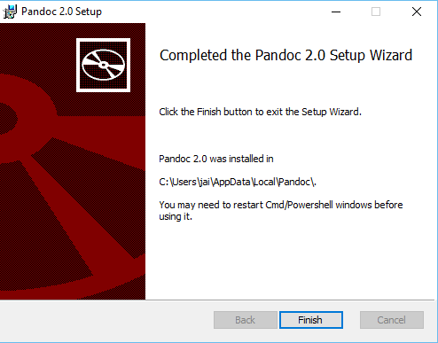

> ### Instalación
> A través de la siguiente pagina : 
[Pandoc](http://pandoc.org/ "Pandoc")
 
> Se descarga el paquete para window según la siguiente imagen: 
> 

> Se instala el paquete abriendo el ejecutable, donde tendremos que aceptar la licencia y 
  darle al botón Install:

> 

> Por ultimo finalizaremos la instalación dándole al botón Finish:
> 